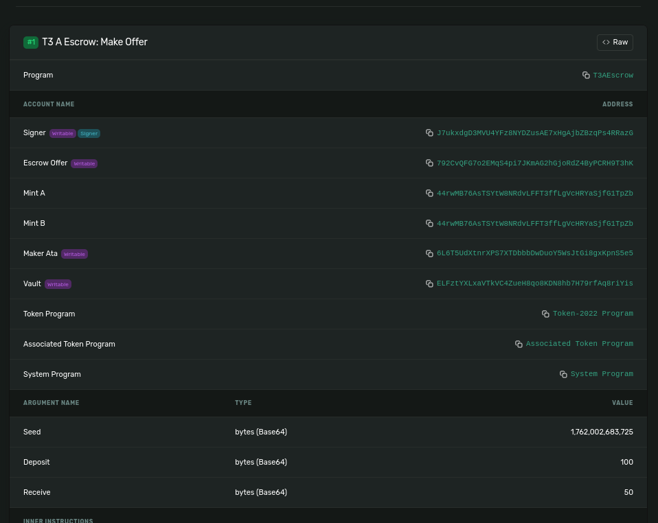
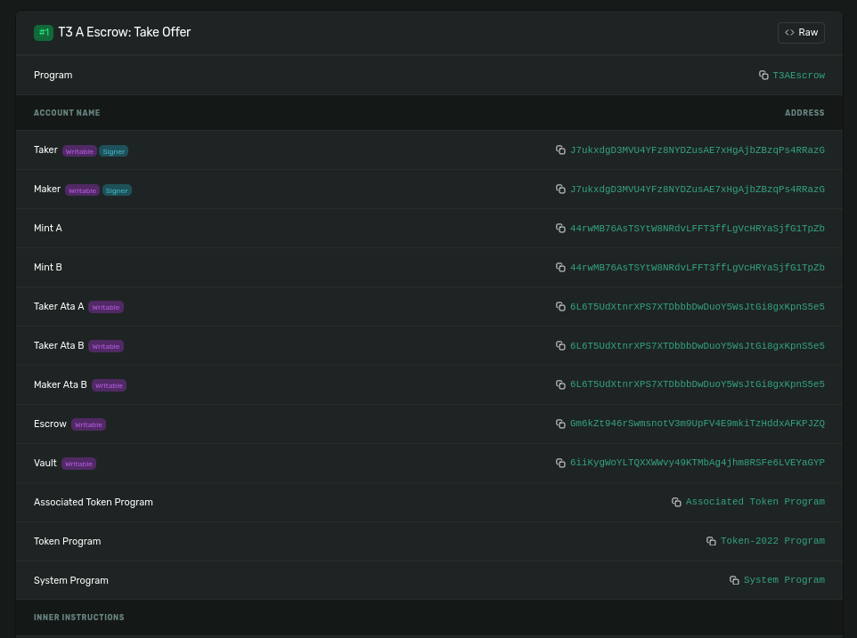
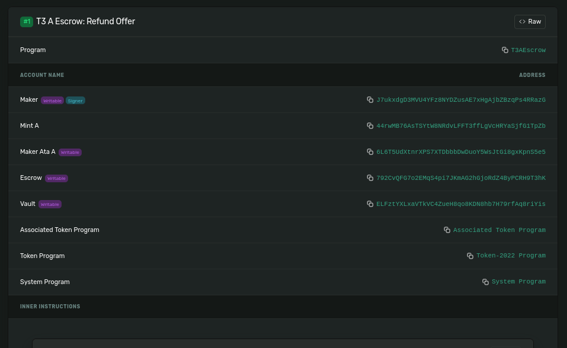

## User Story
As a cautious trader,
Alice wants to safely exchange her tokens without having to trust a stranger directly.

She creates an escrow offer locking 100 T3A into a secure smart contract.
The offer states that she will release her 100 T3A only if another user sends her 50 T3A in return.

Bob discovers Alice’s offer and decides to accept it. When he deposits 50 T3A,
the escrow automatically executes the trade — Bob receives 100 T3A,
and Alice receives 50 T3A — all atomically and trustlessly.

If no one accepts Alice’s offer within the set timeframe,
she can safely cancel the offer, and her 100 T3A are returned to her wallet.
---

# T3A Escrow – Conditional Token Swap (Devnet)

**Token A & B**: `Turbin3-Ansh (T3A)`  
**Mint**: [`44rwMB76AsTSYtW8NRdvLFFT3ffLgVcHRYaSjfG1TpZb`](https://explorer.solana.com/address/44rwMB76AsTSYtW8NRdvLFFT3ffLgVcHRYaSjfG1TpZb?cluster=devnet)  
**Network**: **Solana Devnet**  
**Program ID**: `7LxAAWCdkN23D7dCghPsxGKkKqx7GSWZnuCpJxEWJVe8`  
**Maker Wallet**: `J7ukxdgD3MVU4YFz8NYDZusAE7xHgAjbZBzqPs4RRazG`

---

## 1. Make Offer  
**Lock 100 T3A → Want 50 T3A**

**Transaction**:  
[View on Explorer](https://explorer.solana.com/tx/5kw4WXisx5S1McgBX3nx7BHvnxhXsiR4WRTFqaM5au3w6Lmudf6xqpdgmqvtUspXKokAELXkt2K25R5JxiCrFZfD?cluster=devnet)

> **Escrow PDA created. Vault ATA initialized. 100 T3A locked.**

---

## 2. Take Offer  
**Taker sends 50 T3A → Gets 100 T3A**

**Transaction**:  
[View on Explorer](https://explorer.solana.com/tx/4Zxcfw3N3j2dckeCwrvSctJkgKNKezeTiDxgufJrqHXCxSTYtEGhqMFnDv8EZtjrnQRQ2qy2bwBJmJ7uh4wHBcze?cluster=devnet) 

> **Condition met. Tokens swapped. Escrow closed.**

---

## 3. Refund Offer (Verified)

**Transaction**:  
[View on Explorer](https://explorer.solana.com/tx/4auGVRr25YriiSJ9AwuD59dy9P7StN5e9erf43eR8efxoptxwkB7rr3MxzJHnq5pxxHQWCPpyDWXVE7FMtzbt1CB?cluster=devnet)

> **Maker refunded. Vault closed.**

